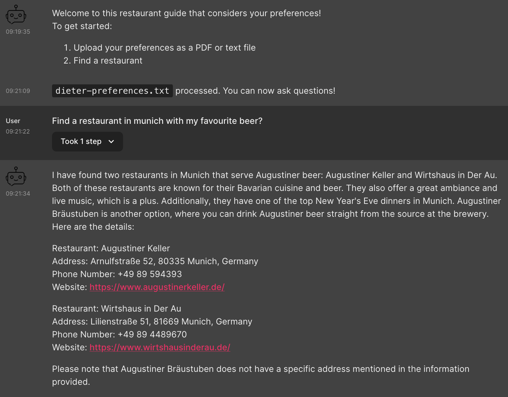

# chatbot-chainlit
[chatbot.py](./chatbot.py) is a travel chatbot example for retrieval augmented generation (rag). [chatbot-agent-restaurant.py](./chatbot-agent-restaurant.py) is a restaurant chatbot that leverages rag + langchain agent using tools.  

## prerequisites
- [signup](https://astra.datastax.com/signup) for Astra 
- [create](https://docs.datastax.com/en/astra-serverless/docs/getting-started/create-db-choices.html#create-vs-db) a Astra DB vector db instance 
## get started
clone this repo 
```
git clone https://github.com/difli/chatbot-chainlit.git
``` 
install dependencies
```
pip install -r requirements.txt
```
make a copy of .env.example
```commandline
cp .env.example .env
```
edit the environment variables of the [.env](.env.example) file
```
OPENAI_API_KEY=
SECURE_CONNECT_BUNDLE_PATH=
ASTRA_DB_TOKEN_BASED_USERNAME=
ASTRA_DB_TOKEN_BASED_PASSWORD=
ASTRA_DB_KEYSPACE=rag_chat_bot
ASTRA_DB_TABLE_NAME=rag_chat_bot
```
run the travel chatbot
```
chainlit run chatbot.py
```
run the restaurant chatbot
```
chainlit run chatbot-agent-restaurant.py
```
## chatbot.py
This chatbot leverages Astra DB, openai, lanchain and chainlit for the ui.

## chatbot-agent-restaurant.py
This chatbot leverages Astra DB, openai, langchain and chainlit for the ui.

